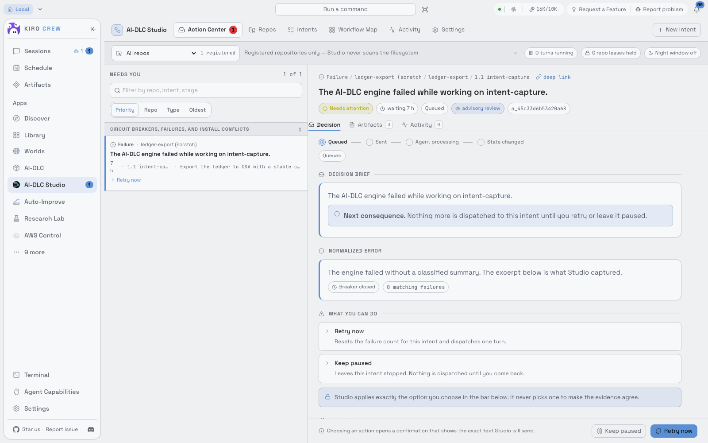

# AI-DLC Studio

[English](README.md) | **简体中文**

KiroCrew 里的 [AI-DLC Workflows](https://github.com/awslabs/aidlc-workflows) 控制台。所有仓库里
AI-DLC 正在等你拍板的事，都汇集到一个队列里，相关证据就摆在旁边。你的决定以你本人发言的方式，经由
AI-DLC 自己的会话送回去，从不绕过它。



## 为什么需要 Studio

AI-DLC 是一套刻意严谨的方法：5 个阶段、33 个步骤、14 个专家 agent，凡是需要人做决定的地方都会停下来，
比如审批关卡、结构化问题、计划批准、故障恢复的选择。严谨正是它的价值所在，但真正拿来干活时也有代价。
每个意图都跑在各自仓库里的各自会话中，检查点因此分散在各处：

- 关卡已经等了一个小时，你要翻聊天记录才发现。
- 批准一份设计时，评审意见和验收标准并不在眼前。
- 三个仓库里的五个意图各自走到哪一步，没法一眼看清。

Studio 去掉了这些代价，同时不削弱这套方法本身。

## 核心价值

- **一个队列装下所有待你决策的事。** 所有已登记仓库的审批关卡、问题、计划批准、缺失输入、故障恢复、失败、
  熔断、安装冲突和工具授权，统一按优先级排好；有新事项时会通知你回来处理。
- **看着证据做决定。** 关卡旁边就是这一步的产物、验收标准、评审结论与发现、未解决的风险和历次修订；问题直接
  变成表单。还可以让只读的 AI 顾问先起草一个答案，你看过之后才会发出。
- **AI-DLC 始终说了算。** Studio 不重新实现任何步骤，也不改任何工作流文件。你的批准以你本人消息的形式，
  发到这个意图自己的 AI-DLC 会话里；AI-DLC 的守卫把它记为一次人工回合，再由引擎校验并推进流程。Studio
  是一个入口，而不是第二个事实来源。
- **不重复发送，也不提前判定完成。** 确认之前你会看到将要发出的原文。每个决定最多送达一次。只有审计记录和
  状态文件证明 AI-DLC 真的处理了，Studio 才把它标为已完成，接口返回 200 不算数。送达情况不确定时，Studio
  会如实告诉你，由你决定下一步。
- **整个生命周期一目了然。** 流程图按阶段泳道展示当前计划，包括 agent、关卡、产物和实时状态；Construction
  阶段会按单元展开成多条泳道。活动时间线标明每个事件来自 AI-DLC、KiroCrew、Git 还是 Studio。
- **几步就能从空仓库走到第一个检查点。** 安装 AI-DLC 是一次先预览、有回执、可回滚的事务。编排计划时能看到准确
  的步骤数和如实的耗时区间。最后一键创建意图的会话，把它放进侧栏中该仓库的文件夹，并开始运行。
- **对自身局限说实话。** 完全无人值守的连续运行（Keep moving）默认关闭，设置页里写明了原因：对 AI-DLC
  来说，任何往会话里发文字的方式都算一次人工回合，Studio 不会假装不是这样。

## 一个决定是怎么送达 AI-DLC 的

```
你点「批准」 →  Studio 显示将要发出的原文  →  你确认
   →  Studio 校验当时记录的证据，并获取该仓库的执行租约
   →  需要时让引擎切到对应的空间和意图，再读回确认
   →  Studio 先把这次待送达的记录持久化
   →  你自己的会话把这段文字发到该意图的 AI-DLC 会话
   →  AI-DLC 的输入钩子记录这次人工回合，总控 agent 读到你的答复
   →  总控调用引擎，由引擎校验这个决定并推进流程
   →  Studio 看到审计记录和状态文件的变化后，才把这个决定标为已完成
```

## Studio 刻意不做的事

- 不重新实现 AI-DLC 的步骤，也不让 KiroCrew 的状态凌驾于 AI-DLC 的磁盘状态之上。
- 不手改工作流的权威文件（`aidlc-state.md`、审计分片、问题文件、意图游标），不伪造批准或人工回合的证据，
  也不设置绕过守卫的环境变量。
- 不编辑产物。「要求修改」是把你的意见发给会话，由 AI 自己修改。
- 不执行任何 Git 写操作，分支、提交、推送、合并都会被拒绝。
- 不自动发现或登记仓库，也不删除意图；归档可随时恢复。

## 快速开始

需要：KiroCrew 0.3.0 或更新版本，macOS 或 Linux。要在仓库里运行 AI-DLC，还需要 Bun、已登录的 `kiro-cli`，
以及支持所用模型的 Kiro 订阅。

```bash
git clone https://github.com/warren830/kirocrew-app-aidlc.git
cd kirocrew-app-aidlc
bash scripts/dev-install.sh --no-build
```

然后在 KiroCrew 里打开 AI-DLC Studio：

1. **仓库 → 添加仓库**，选择项目目录。Studio 会先做只读预检。
2. 如果仓库里还没有 AI-DLC，点 **安装 AI-DLC**。写入任何文件之前，你会先看到全部变更。
3. **新建意图**：依次完成「工作、预设、计划、复核」四步。新建的意图默认暂停。
4. 在意图上点 **创建会话并开始运行**。工作流跑到第一个需要你决定的地方时，它会出现在待办中心。

Bun 安装、从 Discover 安装、更新等完整步骤，见 [中文安装说明](docs/installation.zh-CN.md)。

## 文档

| 文档 | 内容 |
|---|---|
| [README.md](README.md)（英文） | 功能全貌、权限说明、开发方式 |
| [docs/installation.zh-CN.md](docs/installation.zh-CN.md) | 中文安装与更新说明 |
| [docs/AI-DLC-Studio-PRD.md](docs/AI-DLC-Studio-PRD.md) | 产品需求 |
| [docs/design/architecture.md](docs/design/architecture.md) | 模块划分、权限模型、决策记录 |

## 许可证

Apache-2.0（`LICENSE`）。内置的 AI-DLC 发行版为 MIT-0，本地改动见
[THIRD_PARTY_NOTICES.md](THIRD_PARTY_NOTICES.md)。
