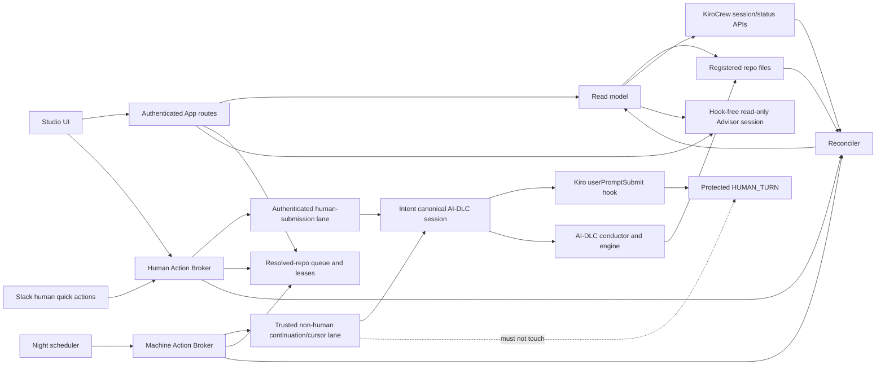

# AI-DLC Studio — Product Requirements Document

| Field | Value |
|---|---|
| Product | AI-DLC Studio |
| Permanent app slug | `aidlc-studio` |
| Status | Draft for mockup and engineering review |
| Date | 2026-09-04 |
| Primary audience | Developers adopting and operating AI-DLC through KiroCrew |
| Initial audience | Internal team; optimized first for multi-repository operators |
| Target release | v1.0 through the KiroCrew official App registry |
| Supported platforms | macOS and Linux; Windows after real end-to-end validation |
| UI languages | English (`en-US`) and Simplified Chinese (`zh-CN`) |
| Source strategy | Contribute under `awslabs/aidlc-workflows/integrations/kirocrew/aidlc-studio`; fall back to an independent public repo only after explicit upstream rejection |

## 1. Executive summary

AI-DLC Studio is the official visual operating surface for AI-DLC Workflows inside KiroCrew. It makes the full AI-DLC lifecycle observable and operable across explicitly registered repositories without replacing AI-DLC's engine, state machine, approval gates, audit trail, agents, stages, or artifacts.

The product is not another workflow engine and not a prettier checklist. Its primary surface is an **Action Center** that aggregates every human-blocking decision across repositories: approval Gates, structured AI questions, missing inputs, recovery incidents, execution failures, and installation conflicts. A first-class **Workflow Map** visualizes the five phases and 33-stage method, including selected/skipped stages, agents, review classes, artifacts, dependencies, per-unit Construction work, and live execution state.

Every workflow-changing action travels through the intent's canonical AI-DLC conversation. The Studio backend never edits `aidlc-state.md`, audit shards, managed artifacts, or questions files, never invokes protected transition commands on the user's behalf, and never enables bypass environment variables. A real App or Slack click is injected as a real user turn; the AI-DLC Kiro hook records the protected `HUMAN_TURN`, and the conductor uses AI-DLC's own engine to commit the transition.

## 2. Problem

AI-DLC v2 provides a mature disk-backed lifecycle with five phases, 33 stages, human Gates, structured questions, specialized agents, reviewers, sensors, artifacts, and audit events. It already ships Kiro CLI and Kiro IDE harnesses. Its engine is the authority and works without KiroCrew-specific reimplementation.

The operating experience is nevertheless fragmented:

1. State is distributed across repositories, spaces, intents, markdown state files, runtime markers, stage graphs, artifacts, questions files, and audit shards.
2. A user must open the right conversation to discover that AI-DLC is waiting for approval or input.
3. Stage status alone does not provide enough context to decide; users need the produced artifact, acceptance criteria, and reviewer findings together.
4. Scope, depth, review intensity, test strategy, and included stages determine duration and cost, but users cannot compare the resulting plan visually before starting.
5. Starting, pausing, resuming, answering, approving, rejecting, recomposing, and recovering work are conversational operations with no consolidated control surface.
6. Multiple repositories and intents require scheduling, canonical-session routing, safe retries, budgets, and notifications.
7. Installing and upgrading the Kiro harness is manual and not idempotent in the current v2 distribution.
8. The existing read-only `aidlc-console` prototype proved disk parsing but was rejected because it merely reflected state and offered no meaningful action.

## 3. Product goals

### G1 — Make human work obvious

A user opening Studio must immediately see every item that needs their judgment, ordered by operational priority across all registered repositories.

### G2 — Put decisions beside evidence

Every Gate or question must show the relevant artifacts, acceptance criteria, reviewer findings, history, and next consequence before the user responds.

### G3 — Make the full method understandable

Users must be able to inspect the complete AI-DLC path, understand why stages are included or skipped, see dependencies and outputs, and follow live progress without reading raw state files.

### G4 — Keep AI-DLC authoritative

Studio must preserve AI-DLC's anti-forgery human-presence guard, engine-owned transitions, state hashes, question digests, artifact verification, reviewer contracts, and append-only audit model.

### G5 — Operate many repositories safely

Studio must support explicit repo namespaces, multiple in-flight intents, repository-scoped execution serialization, cross-repository parallelism, canonical sessions, controlled automation, recovery, and budgets.

### G6 — Reduce installation and planning friction

Users must be able to add a repository, preflight it, install a fixed bundled AI-DLC v2 safely, compose an intent plan, preview its impact, and create the intent from one product.

### G7 — Work away from the desk

Simple blocking decisions must be actionable from Slack and mobile; complex work must deep-link back to the exact Studio decision card.

### G8 — Be publishable as a trusted public App

v1 must meet AI-DLC upstream contribution requirements and the KiroCrew official registry publishing checklist, including assets, docs, permissions, clean install/update, bilingual UI, and macOS/Linux validation.

## 4. Non-goals

v1 will not:

- Reimplement AI-DLC's 33 stages in KiroCrew Dynamic Workflows or Task Runner.
- Treat KiroCrew workflow state as authoritative over AI-DLC disk state.
- Add, delete, reorder, or graphically author arbitrary stage definitions or DAG edges.
- Directly edit AI-DLC-managed artifacts, questions, state, audit, memory, or runtime markers.
- Bypass `HUMAN_TURN`, engine-owned transition guards, reviewer requirements, artifact checks, or plan-approval guards.
- Create Git branches, commits, pushes, merges, checkouts, rebases, or other Git writes.
- Discover repositories by scanning the home directory or filesystem.
- Provide a shared multi-tenant Gateway. Each teammate runs their own KiroCrew and Studio.
- Permanently delete intents.
- Make Slack a complete replacement for Studio.
- Claim exact duration or credit estimates when the inputs are not observable.
- Claim Windows support before real Windows source-install and end-to-end validation.

## 5. Users and primary jobs

### P1 — Multi-repository operator (v1 primary)

Runs several AI-DLC intents across repositories and needs to answer blockers, inspect artifacts, control automation, and understand where work stopped.

**Primary jobs:**

- See all work waiting for me.
- Approve or request changes with enough evidence.
- Let eligible work move unattended without losing control.
- Understand which repo/intent/session owns a running turn.
- Recover safely after crashes or ambiguous delivery.

### P2 — Team adopter

Has KiroCrew, adds a repository, needs AI-DLC installed and wants to run a correctly scoped first intent without learning every CLI flag.

**Primary jobs:**

- Add a repo and understand the preflight.
- Select a sensible scope and plan.
- Know what AI-DLC will do, produce, and ask before spending model usage.
- Learn the lifecycle through the visual map.

### P3 — Method advocate or reviewer

Demonstrates AI-DLC to a team, reviews generated evidence, and explains how stages, agents, reviews, Gates, and auditability fit together.

**Primary jobs:**

- Show the full method without exposing raw implementation files.
- Explain why a stage exists or was skipped.
- Trace a decision from artifact through reviewer to human approval.

## 6. Product principles and hard invariants

### P-01 — Read authority from disk; mutate only through named AI-DLC seams

Studio reads AI-DLC's files and KiroCrew session state. Human workflow decisions are submitted through the intent's canonical AI-DLC conversation. Unattended continuation and active-intent selection may use only a separately authenticated, engine-supported machine seam that has been proven not to mint human-presence evidence. Studio never edits lifecycle state, audit, questions, artifacts, or the active-intent pointer directly. Studio-owned preferences and indexes live only in Studio storage.

### P-02 — One authority per concern

- AI-DLC owns lifecycle, plans, stages, Gates, questions, artifacts, reviews, state, cursor transitions, and audit.
- KiroCrew owns sessions, turns, trusted human-vs-machine submission provenance, scheduling, Slack delivery, App authentication, and runtime policy.
- Studio owns repo registration, projections, action delivery records, canonical-session bindings, queues, preferences, archives, estimates, and App activity.

### P-03 — Never fabricate human action

A Gate approval or answer is valid only after an authenticated human explicitly submits it through the human-submission lane. Advisor output and unattended scheduler work are machine actions and must never traverse a transport that fires AI-DLC's human-presence hook. No prompt sentinel, model instruction, backend transition shortcut, or bypass environment variable may substitute for trusted transport provenance.

### P-04 — No silent conflict resolution

When state sources disagree, installation files have drifted, or delivery is uncertain, Studio shows the contradiction and blocks unsafe progression. It never selects a convenient source as truth.

### P-05 — Concurrency follows AI-DLC's real cursor model

Multiple intents may be in flight in one repo, but execution turns are serialized by a lease keyed to resolved repository identity because the active-intent cursor and ordinary state resolution are repo-shared. Before dispatch, Studio must switch the cursor through an engine-supported seam and read it back; any mismatch blocks the turn. Different repos may execute in parallel.

### P-06 — A complete old version is better than a mixed new version

Install and upgrade are transactional. Any failure restores the prior complete receipt-owned installation.

### P-07 — Estimate honestly

Exact counts are labeled exact. Time, turns, and credits are ranges with source and confidence. Unobservable metrics are shown as unavailable.

### P-08 — Unproven transport is a release blocker

Automatic Run, night scheduling, stable-boundary failover, and machine cursor switching remain disabled until spikes prove a host-supported machine submission path that does not fire `userPromptSubmit`, increment `HUMAN_TURN`, move the human-turn marker, or impersonate a user. Human Gate/question actions remain enabled only through the separately proven human-submission path.

## 7. Verified technical basis

The following facts are already verified and are not assumptions:

1. AI-DLC v2 ships `kiro` and `kiro-ide` harnesses; the core engine is projected consistently across harnesses.
2. The public engine exposes `next`, `continue`, `report`, and `park`; lifecycle transition handlers are engine-owned.
3. Human-gated reports require exact user input and a protected `HUMAN_TURN` after the prior resolution boundary.
4. The Kiro `userPromptSubmit` adapter emits `HUMAN_TURN`, updates the human-turn marker, and advances the turn counter for prompts delivered through that hook.
5. A real KiroCrew ACP prompt sent by a human test to an `aidlc` project session increased `HUMAN_TURN` from 1 to 2 and the turn counter from 1 to 2. This proves human-submission capability once; the stable App API and source provenance remain unproven in S5.
6. The continue-workflow Stop hook releases turns at `[?]` and `[R]`, so an already-running loop can stop at human boundaries.
7. It is not yet verified whether KiroCrew AutoNudge, cron, App-driven continuation, or another machine prompt path also fires `userPromptSubmit`. Until S12 proves otherwise, those paths must be treated as capable of falsely moving human-presence evidence and cannot drive unattended work.
8. AI-DLC uses a repo-shared active-intent cursor for ordinary state routing; session stamps do not make simultaneous intent turns safe.
9. Per-intent locks serialize state/audit transactions but do not lock model artifact generation for an entire stage.
10. AI-DLC's MIT No Attribution license permits redistribution.
11. KiroCrew App registry entries support `gitUrl` plus a monorepo `subdirectory`.
12. Third-party executable App code remains subject to explicit per-App trust even when registry-listed; blanket third-party trust is unnecessary.
13. The existing parser prototype has 66 passing tests against real 33-stage and 32-stage examples and has passed AppManifest validation and App installation.

## 8. Information architecture

### 8.1 Primary navigation

1. **Action Center** — default home; cross-repo human work queue.
2. **Repos** — registered repositories, installation health, versions, Git observation, and maintenance.
3. **Intents** — searchable intent inventory with running, queued, waiting, parked, failed, completed, and archived views.
4. **Workflow Map** — five-phase visual map with stage inspector.
5. **Activity** — human-readable timeline with raw evidence drill-down.
6. **Settings** — schedules, budgets, Slack, locale, display preferences, and diagnostics.

### 8.2 Namespace hierarchy

`All repos → Repo → Space → Intent → Stage → Unit`

A persistent scope bar appears on operational pages. `All repos` is a virtual namespace over the explicit Studio repo registry; it never triggers filesystem discovery.

### 8.3 Desktop layout

Action Center uses a two-column master-detail layout:

- Left, approximately 36%: action queue, search, filters, grouping, and compact item summaries.
- Right, approximately 64%: action-type-specific decision content.
- Top: scope bar plus collapsible execution/status strip.
- Right detail tabs when applicable: `Decision`, `Artifacts`, `Review`, `Activity`.
- Bottom of detail: sticky action bar for the current decision.

### 8.4 Mobile layout

At 390px and above, Action Center uses list → detail navigation. It supports the complete decision loop, while repo registration, path selection, installation, upgrade, and batch administration remain desktop-only.

## 9. Functional requirements

### 9.1 App distribution and identity

- **FR-DIST-001:** Product display name is **AI-DLC Studio**.
- **FR-DIST-002:** Permanent App slug is `aidlc-studio`.
- **FR-DIST-003:** Public source is proposed under `integrations/kirocrew/aidlc-studio` in `awslabs/aidlc-workflows`.
- **FR-DIST-004:** If AI-DLC maintainers explicitly reject that scope, move the self-contained App directory to an independent public repo without changing the slug, storage schema, or registry contract.
- **FR-DIST-005:** v1 release requires a merged KiroCrew official registry entry and one-click install from Discover.
- **FR-DIST-006:** The registry entry remains non-builtin and requests only narrow per-App trust.
- **FR-DIST-007:** The App manifest, actual license, bundled AI-DLC license notice, release assets, and README must agree.
- **FR-DIST-008:** App version and bundled AI-DLC version are separately visible.

### 9.2 Repository registry

- **FR-REP-001:** Users add repositories manually by selecting or entering an absolute path.
- **FR-REP-002:** Studio never scans the home directory, parent workspaces, or arbitrary Git roots.
- **FR-REP-003:** Studio computes a resolved repo identity from canonical realpath plus device/inode where available, with canonical realpath plus Git common-dir/worktree identity as the deterministic fallback.
- **FR-REP-004:** The registry stores a stable Studio repo id, resolved repo identity, label, canonical path, platform, AI-DLC install status, engine version, receipt status, and last scan result.
- **FR-REP-005:** Registration refuses a second path that resolves to an existing identity. If uniqueness cannot be proven, the repo may be observed but execution/install remain disabled until the duplicate is resolved.
- **FR-REP-006:** Execution and admin leases are keyed by resolved repo identity, never by the user-facing repo id or path string alone.
- **FR-REP-007:** Removing a repo unregisters it only; it never deletes or edits repo content.
- **FR-REP-008:** `All repos` queries only registered repos.
- **FR-REP-009:** Broken, moved, unavailable, or permission-denied repos remain visible with explicit remediation. A moved repo must be rebound to the old identity or the unavailable record removed before a new identity can execute.

### 9.3 Repo preflight and AI-DLC installation

- **FR-INST-001:** Adding a repo runs a read-only preflight for platform, Git state, Bun, existing harnesses, AI-DLC state, version, symlinks, conflicts, free space, and file permissions.
- **FR-INST-002:** A repo without AI-DLC can be registered and shown as `Not installed`.
- **FR-INST-003:** The user can install the exact AI-DLC v2 payload bundled with Studio.
- **FR-INST-004:** Installation previews all managed paths and conflicts before confirmation.
- **FR-INST-005:** The installer owns only receipt-listed framework files and never owns `aidlc/spaces`, intent artifacts, audit shards, memory, plugin selection, project code, or whole project-owned Kiro settings files.
- **FR-INST-006:** `.kiro/settings/cli.json`, `.kiro/settings/mcp.json`, existing agent configuration, and root onboarding files are merge targets, never wholesale replacement targets. Studio must preserve unknown/user-owned keys and secrets, and receipt only the exact managed fragment or generated file it can later verify.
- **FR-INST-007:** On first install with no receipt, byte-identical pre-existing framework files may be adopted into the receipt. Any differing pre-existing file at a managed path is an unowned conflict and blocks installation with a diff; v1 provides no force-overwrite shortcut.
- **FR-INST-008:** Every managed file or fragment is recorded with version, source, relative path/key, ownership kind, and SHA-256 or canonical value digest.
- **FR-INST-009:** Existing user-modified receipt-owned content stops installation or upgrade; Studio never silently overwrites it.
- **FR-INST-010:** A new version may retire an old receipt-owned file only when its live bytes still match the old receipt. Modified retired files are preserved and reported.
- **FR-INST-011:** Installation uses staging plus a repo admin lease that is mutually exclusive with execution, atomic replacement/merge, post-install validation, and receipt commit. It queues behind a live execution lease and never preempts it.
- **FR-INST-012:** Failure restores the previous complete installation and receipt.
- **FR-INST-013:** Rollback failure marks `Install recovery required` and blocks AI-DLC execution until a separately authenticated recovery operation validates and clears it.
- **FR-INST-014:** App updates scan registered repos and present a batch-confirmable upgrade list.
- **FR-INST-015:** Upgrade never depends on AI-DLC's currently unavailable public `upgrade` verb.

### 9.4 Action Center

- **FR-ACT-001:** Action Center is the default route.
- **FR-ACT-002:** It aggregates Gate approvals, AI questions, missing inputs, delivery uncertainty, recovery incidents, failures, circuit breakers, and installation conflicts.
- **FR-ACT-003:** Default order is:
  1. Recovery required and delivery uncertain.
  2. Blocking Gates and questions.
  3. Circuit breakers, failures, and install conflicts.
  4. Budget stops and pauses.
- **FR-ACT-004:** Equal-priority items sort oldest first.
- **FR-ACT-005:** Users can switch among Priority, Repo, Type, and Oldest organization; the choice persists locally.
- **FR-ACT-006:** Every row shows repo, space when non-default, intent, stage, type, waiting duration, severity, and primary next action.
- **FR-ACT-007:** Resolving an action removes it only after its declared resolution evidence is observed. A response that legitimately expects no lifecycle transition may resolve from a completed host turn plus superseded question/boundary token; it must not wait forever for a state transition that is not part of its contract.
- **FR-ACT-008:** Maintenance upgrades remain on Repos and notifications; they do not enter the blocking workflow queue. Only an install conflict or failed rollback that blocks execution becomes an Action Center item.
- **FR-ACT-009:** Every actionable card captures a stable state hash, boundary token, question digest where applicable, and artifact evidence snapshot. Reads used as decision evidence must be stable across a size/mtime/hash recheck; changing files render as `Refreshing` and cannot be submitted against.
- **FR-ACT-010:** Submit is compare-and-submit. If the live state hash, question digest, stage attempt, Gate boundary, or required evidence differs from the captured action, refuse with `action_stale`, refresh the card, and never forward the old answer.

### 9.5 Action detail templates

The detail pane shares breadcrumb, source, delivery state, Activity, evidence access, and deep-link behavior. Its body is type-specific.

#### Gate template

- Decision brief and consequence.
- Stage acceptance criteria.
- Produced artifacts.
- Reviewer findings quoted and linked.
- Unresolved risks and prior revisions.
- AI Advisor analysis on demand.
- Sticky `Approve` and `Request changes` controls.

#### Questions template

- Exact ordered question group.
- Single/multi-select behavior and `Other` escape hatch.
- Option descriptions and linked context.
- On-demand `Explain`, `Draft this`, and `Draft all` Advisor actions.
- One atomic `Send answers` action.

#### Recovery template

- Last stable boundary.
- State, audit, directive, session, and delivery evidence.
- Contradictions and risk classification.
- Engine/canonical-session recovery choices.

#### Failure and circuit-breaker template

- Normalized error summary and fingerprint.
- Retry count, backoff history, and breaker reason.
- Relevant logs and session state.
- `Retry now`, `Diagnose with AI`, and pause controls.

#### Missing-input and budget-stop template

- The exact missing input or exhausted budget and the operation it blocks.
- Source, current configured limit, consumed amount where observable, and reset window.
- `Provide input`, `Adjust budget`, `Resume`, or `Keep paused` according to policy.
- No inferred credit value when usage is unobservable.

#### Install conflict template

- Receipt ownership and version.
- Managed-file diff.
- User-modified conflict explanation.
- Safe stop and remediation path; no overwrite shortcut.

### 9.6 Repo, space, and intent inventory

- **FR-INV-001:** Repos page shows installation health, bundled/installed versions, active intents, repo queue, Git observation, and maintenance actions.
- **FR-INV-002:** Intents page supports All repos and namespace filters.
- **FR-INV-003:** Intent states include `Idle`, `Queued`, `Running`, `Waiting for you`, `Paused`, `Parked`, `Interrupted`, `Circuit open`, `Failed`, `Completed`, and `Archived` where applicable.
- **FR-INV-004:** Multiple intents may be in flight in one repo.
- **FR-INV-005:** A reversible Studio archive hides an intent from default views without changing AI-DLC files.
- **FR-INV-006:** v1 provides no permanent intent deletion.

### 9.7 New intent wizard

New intent creation uses four steps:

1. **Work** — repo, space, objective, context, and project type signals.
2. **Preset** — scope, depth, review cap, and test strategy; may be filled from an Advisor proposal whose stage changes are then reviewed in Plan (FR-NEW-006).
3. **Plan** — five-phase stage matrix with dependency validation.
4. **Review** — plan diff, exact counts, estimates, products, Gates, and Create.

Requirements:

- **FR-NEW-001:** Creation never auto-runs the intent.
- **FR-NEW-002:** The review step distinguishes exact facts from estimates.
- **FR-NEW-003:** Create uses the canonical conversation path and verifies the resulting intent on disk.
- **FR-NEW-004:** The new intent does not inherit `Keep moving`, budgets, or Advisor drafts from another intent. A proposal the Advisor drafted in the wizard is not such a draft: it exists only as values the human accepted into the wizard's own fields.
- **FR-NEW-005:** The user starts execution with `Run to next checkpoint`.
- **FR-NEW-006:** At the Preset step the human may ask the AI Advisor, by an explicit click, to propose scope, depth, test strategy, review cap and stage changes from the objective, the context and bounded repository evidence. The proposal is rendered as the plan diff PlanService computes from the proposed settings, is labelled as the Advisor's draft, fills nothing until the human accepts it, stays editable field by field, and is cleared in one action. A proposed stage change the engine refuses is shown as the engine's refusal and is never accepted into the plan. The proposal itself — its text, reasoning and provenance — is never written into the intent; only the values the human accepted and kept reach Create, as the human's own choices (FR-NEW-004).

### 9.8 Intent Plan Composer

- **FR-PLAN-001:** The composer reads the installed graph, scope grids, stage metadata, dependency/consume/produce relations, review class, agent, and Gate derivation.
- **FR-PLAN-002:** Users select scope, depth, review, and test strategy and see the effective plan.
- **FR-PLAN-003:** The five-phase matrix shows every known stage, including excluded and conditional stages.
- **FR-PLAN-004:** Users may enable or skip only stages the AI-DLC engine permits.
- **FR-PLAN-005:** Required, dependency, current, completed, or otherwise immutable stages are disabled with a reason.
- **FR-PLAN-006:** Every change recomputes exact stage/Gate/artifact counts and estimated effort.
- **FR-PLAN-007:** Before apply, show a plan diff and downstream consequences.
- **FR-PLAN-008:** Running-intent recompose uses a single-page matrix and can modify only pending ahead-of-cursor stages.
- **FR-PLAN-009:** Scope/config changes preview their effective diff before confirmation.
- **FR-PLAN-010:** v1 does not author arbitrary stage definitions or reorder the DAG.
- **FR-PLAN-011:** Custom/plugin stages already present in the installed graph are displayed and can participate according to engine rules.

### 9.9 Estimates

- **FR-EST-001:** Stage count, Gate count, artifact count, and configured review intensity are exact.
- **FR-EST-002:** Turns, active execution time, elapsed time, and credits are ranges with source and confidence.
- **FR-EST-003:** Initial estimates use rule-based bands.
- **FR-EST-004:** Local history may calibrate estimates by scope, depth, stage, repo scale, model where observable, review iterations, and test duration.
- **FR-EST-005:** Unobservable credits are `Unavailable`, not zero and not inferred from unrelated products.
- **FR-EST-006:** After execution, show Estimated vs Actual and retain local calibration data.
- **FR-EST-007:** Show which selected stages dominate the estimate and what coverage is lost if removed.

### 9.10 Workflow Map

- **FR-MAP-001:** The primary view is five horizontal phase swimlanes: initialization, ideation, inception, construction, operation.
- **FR-MAP-002:** Stage cards show state, agent, Gate, review class, elapsed time, artifacts, and current execution marker.
- **FR-MAP-003:** Skipped and conditional stages retain their position and reason.
- **FR-MAP-004:** Default view does not draw every dependency edge.
- **FR-MAP-005:** Selecting a stage overlays upstream, downstream, consumes, and produces relationships.
- **FR-MAP-006:** Construction per-unit stages can expand into unit sub-lanes.
- **FR-MAP-007:** Density modes are Overview, Detailed, and Dependencies.
- **FR-MAP-008:** Stage selection opens an inspector for artifacts, review, audit, and eligible operations.
- **FR-MAP-009:** Mobile uses phase accordions rather than a shrink-to-fit canvas.

### 9.11 Artifacts and review

- **FR-ART-001:** Studio renders AI-DLC artifacts read-only.
- **FR-ART-002:** Support headings, tables, lists, links, code blocks, diagrams where safely renderable, and plain-text fallback.
- **FR-ART-003:** Provide table of contents, file metadata, stage/unit association, and path reveal subject to KiroCrew policy.
- **FR-ART-004:** Show current-vs-prior diff when a prior version can be derived safely from Git or retained Studio observation.
- **FR-ART-005:** Anchor reviewer findings to the relevant artifact/section where evidence permits.
- **FR-ART-006:** `Request changes` sends feedback to the canonical session; it does not edit the artifact.
- **FR-ART-007:** Users may open a file in a local editor through an existing approved KiroCrew affordance; Studio itself remains read-only.
- **FR-ART-008:** Artifact mutations are not attributed to Studio unless Studio actually requested them through an action record.

### 9.12 Structured AI questions

- **FR-Q-001:** When S1 proves a structured live payload is available, the question card preserves exact prompt, header, order, option labels/descriptions, single/multi-select semantics, grouping, and free-text `Other`; no prose parsing may substitute for that payload.
- **FR-Q-002:** Multiple questions from one turn are answered as one ordered group.
- **FR-Q-003:** All required answers must be present before submit.
- **FR-Q-004:** Submit is atomic from the user's perspective and carries one Studio action id.
- **FR-Q-005:** Studio never edits `*-questions.md` or its digest.
- **FR-Q-006:** A question remains visible until delivery and its declared resolution evidence prove it was accepted or superseded.
- **FR-Q-007:** When no native payload is available, a supported, stable persisted question artifact may provide the exact form controls through the verified file-backed grouped-answer transport (2026-09-11 verification). Ambiguous formats and native blocking question waits remain degraded and link to the canonical conversation. Studio never invents options or writes answers into the artifact itself.

### 9.13 AI Advisor

- **FR-ADV-001:** Advisor runs only on a human request. The request is per card and explicit by default; in the new-intent wizard, where no card exists yet, it is per repository, on an explicit click, one live proposal per repository and objective (FR-NEW-006). A repository owner may instead grant it once, per repository, in Settings (`advisor.auto_draft_repo_ids`, empty on every install), and Studio then requests one draft per eligible card on that standing grant. There is no automatic trigger beyond that grant: a repository the owner has not listed never draws a draft nobody asked for, the grant is revocable by unchecking it, and revoking it stops future drafts without touching drafts already made. The grant covers the cards already waiting when it is given, oldest first — a switch that did nothing until the next card arrived would read as broken on the very card the owner turned it on for.
- **FR-ADV-002:** Advisor uses a separate App-owned session with a non-`aidlc` agent, no AI-DLC project binding, and no AI-DLC hooks. AdvisorBroker reads a bounded evidence package through the Studio read model and passes that evidence in-band; the Advisor session never opens the registered repo as its working project.
- **FR-ADV-003:** Advisor tools and policy forbid file writes, shell mutations, workflow transitions, Git writes, App security changes, and access beyond the evidence package.
- **FR-ADV-004:** Question drafts include suggested answer, evidence, assumptions, alternatives, and confidence.
- **FR-ADV-005:** Gate analysis checks acceptance criteria, reviewer findings, contradictions, unresolved risks, and confidence.
- **FR-ADV-006:** Advisor may draft Request changes feedback.
- **FR-ADV-007:** Advisor never auto-submits or preselects Approve. An Advisor round-trip must leave AI-DLC audit, turn counter, human-turn marker, state, directive, and question digest byte-for-byte unchanged. A wizard plan draft has no intent to keep neutral: its round-trip must leave the repository tree byte-for-byte unchanged, which Studio proves by test rather than by a per-draft probe, and such a draft reports no neutrality object.
- **FR-ADV-008:** Claims that cannot be answered from available evidence are labeled `Needs your decision`.
- **FR-ADV-009:** Advisor activity is recorded in Studio Activity, not forged into AI-DLC audit.
- **FR-ADV-010:** Drafting ahead is bounded and at most once. One automatic draft per card for that card's whole life — an automatic draft that fails is never automatically retried, only the human's click can ask again; never more automatic drafts in flight than `ADVISOR_AUTO_DRAFT_MAX_INFLIGHT` across the installation; never for a degraded question card (FR-Q-007) or for a card type that has no automatic kind, and never for a kind that has no card — a wizard plan proposal is only ever drafted on the human's click. Studio records every automatic request in Activity as automatic, distinguishable from a click, and settles drafts nobody is watching so a draft prepared in advance is still readable when the human arrives.
- **FR-ADV-011:** A card whose draft was prepared ahead may have the Advisor's answers filled into the question form on the human's behalf: once per draft, only into questions the human has neither answered nor typed into, and only from a draft whose evidence still matches. The fill is labeled as the Advisor's words, states that nothing has been sent, and is removable in one action. FR-ADV-007 is unchanged by it — nothing is submitted, Approve is never preselected, and no gate control is ever pre-filled.

### 9.14 Gate actions

- **FR-GATE-001:** Approve requires a compact inline confirmation that shows both the localized UI label and the exact canonical text that will be sent.
- **FR-GATE-002:** The wire text is the engine-supplied response token/choice when available; otherwise it is a Studio protocol constant displayed verbatim before confirmation. Studio never derives wire text by translating a label.
- **FR-GATE-003:** Request changes/reject requires nonblank feedback, sent exactly as confirmed.
- **FR-GATE-004:** The user must be able to review artifact and findings before the confirmation control.
- **FR-GATE-005:** Studio sends the human's confirmed canonical choice through the authenticated human lane to the canonical AI-DLC session.
- **FR-GATE-006:** Studio never shells directly to `report`, edits state/cursor, appends protected audit events, or enables guard bypasses.
- **FR-GATE-007:** Success requires observed AI-DLC state/audit movement, not merely a successful HTTP response.

### 9.15 Canonical sessions and execution

- **FR-SES-001:** Each intent has at most one canonical execution session at a time.
- **FR-SES-002:** Human App and Slack decisions route to the canonical session through an authenticated human-submission lane whose `userPromptSubmit`/`HUMAN_TURN` behavior is intentional and observable.
- **FR-SES-003:** Cron, AutoNudge, `Keep moving`, stable-boundary failover continuation, and machine cursor selection must use a distinct trusted machine lane. That lane must not fire `userPromptSubmit`, increment the AI-DLC turn counter, append `HUMAN_TURN`, or move the human-turn marker. These features remain disabled until S12 proves the contract.
- **FR-SES-004:** A resolved repository identity has at most one execution lease; only one intent turn executes in that repo at a time. Different resolved repo identities may execute concurrently within resource limits.
- **FR-SES-005:** Install, upgrade, receipt recovery, and pre-intent creation acquire a repo admin lease that is mutually exclusive with the execution lease. Admin operations queue behind, and never preempt, a live execution owner.
- **FR-SES-006:** Before any execution dispatch, Studio switches space/intent only through an AI-DLC engine-supported machine operation, then reads back active space, active intent UUID, state path, and state hash while still holding the lease. Any mismatch, uncertain switch result, or intervening cursor change refuses dispatch. Studio never edits cursor files directly. This path remains release-blocked until S13 passes.
- **FR-SES-007:** A busy live owner is never preempted automatically. Lease age alone is not evidence that the owner is dead.
- **FR-SES-008:** Every action exposes the canonical action-state enum defined in §11.1, including `Delivering`, `Delivered`, `Processing`, `ResolvedNoTransition`, `StateChanged`, `NotDelivered`, and `DeliveryUncertain`.
- **FR-SES-009:** Session replacement from a stable boundary reconstructs context from disk; unconfirmed model output is not treated as truth.
- **FR-SES-010:** Studio records and verifies the expected human-turn marker behavior for every dispatch class. Any machine dispatch that changes human-presence evidence opens a deterministic security breaker and disables automation for that repo.

### 9.16 Manual run controls

- **FR-RUN-001:** `Run to next checkpoint` begins with an authenticated human command, then may advance unattended only through the proven machine lane until Gate, question, failure, pause, budget stop, or completion. If S12 has not passed, Run performs only the human-initiated turn and does not arm unattended continuation.
- **FR-RUN-002:** Advance, Resume, and safe Retry are one-click actions protected by repo lease, compare-and-submit preconditions, and idempotency checks.
- **FR-RUN-003:** `Pause after current turn` stops AutoNudge and future dispatch while allowing the current turn to finish.
- **FR-RUN-004:** `Force stop now` is secondary, requires confirmation, cancels the current KiroCrew turn, and marks the intent Interrupted.
- **FR-RUN-005:** Scheduler and cron never invoke force stop automatically.

### 9.17 Night work window

- **FR-NIGHT-001:** Night automation is off by default and unavailable until S12 proves the trusted machine lane.
- **FR-NIGHT-002:** Users configure local-time work-window start/end, turn cap, and credits cap when observable.
- **FR-NIGHT-003:** Only intents with explicit `Keep moving` participate.
- **FR-NIGHT-004:** Scheduling is round-robin within a resolved repo identity and parallel across repos. Every machine dispatch records pre/post human-turn marker evidence and fails closed on movement.
- **FR-NIGHT-005:** Gate, question, failure, circuit breaker, manual pause, and completion remove an intent from eligible work.
- **FR-NIGHT-006:** Budgets are checked before dispatch and never interrupt an already-running turn.
- **FR-NIGHT-007:** Unobservable credit budgets are disabled with explanation; turn budgets remain available.
- **FR-NIGHT-008:** A morning digest reports the exact progressed intents/stages, produced artifacts, boundary/error/budget stop reasons, turns attempted/succeeded, observable usage, estimates vs actuals, and actions waiting for the user.

### 9.18 Slack and mobile

- **FR-SLK-001:** Slack is notification plus quick action, not a full Studio clone.
- **FR-SLK-002:** Default delivery is the configured KiroCrew owner DM.
- **FR-SLK-003:** Notify on Gate, question, execution failure/circuit break, delivery uncertainty, and completion digest; do not notify every stage transition.
- **FR-SLK-004:** A quick action is eligible only when the exact action is current under compare-and-submit, all required decision evidence fits the bounded Slack card, the response is one simple selection or confirmed Approve, and no unresolved Recovery/Delivery uncertain/critical finding requires Studio context.
- **FR-SLK-005:** Complex question groups, multi-select, long free text, long artifacts, high-risk findings, and recovery deep-link to Studio.
- **FR-SLK-006:** Slack Approve uses a second inline confirmation.
- **FR-SLK-007:** Slack replies use the same durable action id and human-submission lane as Studio.
- **FR-SLK-008:** Every message includes a deep link to the exact Action Center item. Deep links carry identifiers only and never carry bearer credentials or action authorization.
- **FR-MOB-001:** Mobile web completes Gate, question, Advisor, Request changes, pause, force-stop confirmation, artifact reading, and Activity flows.
- **FR-MOB-002:** Repo registration, filesystem path selection, install/upgrade, and batch administration are desktop-only.

### 9.19 Activity and evidence

- **FR-EVT-001:** Default Activity is a human-readable timeline grouped by repo, intent, stage, and turn.
- **FR-EVT-002:** Every event identifies its source: AI-DLC, Studio, KiroCrew, or Git.
- **FR-EVT-003:** Studio never presents a derived event as an original AI-DLC audit event.
- **FR-EVT-004:** Link action id, KiroCrew session id, AI-DLC audit block, state transition, and Git observation where available.
- **FR-EVT-005:** Filters include time, source, stage, action type, and severity.
- **FR-EVT-006:** Evidence drawer exposes raw audit blocks, payloads, and file locations subject to redaction and access policy.
- **FR-EVT-007:** Diagnostic export redacts protected paths, credentials, prompt bodies by default, and unrelated repo content.

### 9.20 Git observation

- **FR-GIT-001:** Show current branch, dirty status, ahead/behind when safely obtainable, relevant diffs, and related commits.
- **FR-GIT-002:** Studio never runs Git write operations.
- **FR-GIT-003:** `Ask AI to prepare commit` is a canonical-session request, not a backend Git command.
- **FR-GIT-004:** Installation and upgrade conflicts consider receipt-owned file drift independently from unrelated dirty files.
- **FR-GIT-005:** Git observation failures do not hide workflow state; they appear as a separate degraded capability.

### 9.21 Settings

Settings include:

- Locale and display density.
- Queue organization preference.
- Night work window, turn cap, and observable credit cap.
- Global concurrency cap; per-repo execution remains one.
- Slack notification enablement and per-repo mute.
- Advisor model inherited through KiroCrew role resolution; no hardcoded model id.
- Diagnostic retention and export.
- App version, bundled AI-DLC version, supported platform, and update state.

### 9.22 Prototype migration

- **FR-MIG-001:** Detect the local `aidlc-console` prototype and present a one-time migration preview before enabling `aidlc-studio`.
- **FR-MIG-002:** Migrate only Studio-owned repo registry, archive metadata, preferences, and compatible action-free history; never copy credentials or AI-DLC repo data.
- **FR-MIG-003:** Rewrite internal repo ids/action links under a versioned migration transaction and validate counts before committing.
- **FR-MIG-004:** Disable/remove stale routes, sidebar registration, and narrow trust for `aidlc-console` only after `aidlc-studio` validates; preserve a bounded rollback backup in App storage.
- **FR-MIG-005:** Never show both Apps as active control surfaces for the same repo.

## 10. Visual system

### 10.0 Selected visual specification

**Option B — Evidence First** is the approved visual baseline. Its source mockup is `/Users/ychchen/warren_ws/kirocrew-app-aidlc/mockups/option-b-evidence-first.html` until the integration directory moves upstream. Implementation and refinement must preserve its calm master-detail hierarchy, narrow priority queue, evidence-first Decision pane, readable acceptance criteria, and restrained KiroCrew-native styling.

Option A and Option C are rejected as primary visual directions. No layout, command surface, density, or status-strip element may be imported from them without an explicit targeted visual revision and user acceptance. The selected mockup is a visual specification, not production code; PRD transport, security, state, accessibility, localization, and recovery requirements override stale sample text in the mockup.

### 10.1 Style

- Use KiroCrew design tokens, typography, spacing, radii, focus treatment, and light/dark themes.
- Add restrained phase accents for the five AI-DLC phases.
- Use color, icon, label, and shape together; never color alone.
- Use `lucide-react`; no emoji in UI.
- Default density is compact but touch targets remain accessible.
- Honor reduced motion.

### 10.2 Specialized detail behavior

- Decision content scrolls independently from the queue.
- Sticky action bars do not obscure the final evidence block.
- Selecting another queue item preserves unsent form drafts locally and warns before discarding.
- Deep links restore scope, selected action, tab, and evidence anchor.
- Empty states explain the next useful action, not merely “No data.”

### 10.3 Accessibility

- All controls keyboard reachable in a predictable order.
- Visible focus rings use KiroCrew tokens.
- Screen-reader labels include action type, repo, intent, stage, and state.
- Phase/status meaning remains legible at WCAG AA contrast and without color.
- Tables and swimlanes have list/table semantic alternatives.
- Live execution updates use polite announcements; errors and delivery uncertainty use assertive announcements sparingly.

## 11. State models

### 11.1 Canonical action state

The only action-state enum is:

`Draft | Queued | Delivering | Delivered | Processing | StateChanged | ResolvedNoTransition | NotDelivered | DeliveryUncertain | ReconciliationRequired | Failed | Cancelled`

```text
Draft → Queued → Delivering
Delivering → Delivered | NotDelivered | DeliveryUncertain
Delivered → Processing | DeliveryUncertain
Processing → StateChanged | ResolvedNoTransition | DeliveryUncertain | Failed
DeliveryUncertain → ReconciliationRequired
ReconciliationRequired → StateChanged | ResolvedNoTransition | NotDelivered | Failed
NotDelivered → Queued | Cancelled
```

Rules:

- Human decisions are at-most-once after the durable `Delivering` transition; no automatic replay follows `Delivered` or uncertainty.
- `Delivering → NotDelivered` requires an authoritative host response that the prompt was never enqueued.
- Transport loss after durable `Delivering` and before a definitive enqueue result produces `DeliveryUncertain` immediately.
- A delivered/processing action becomes uncertain if its session terminates, is replaced, or reaches the host turn deadline before a turn boundary/result is observed. A merely long-running live turn is not uncertain before that deadline.
- `ResolvedNoTransition` requires a completed host turn plus action-specific evidence that the pending question/boundary token was accepted or superseded when no lifecycle transition is expected.
- Cancellation is provably safe only in `Draft`/`Queued`, after authoritative `NotDelivered`, or when the host confirms cancellation before execution began.
- UI labels and APIs use this enum; no alternate shorthand state list is permitted.

### 11.2 Canonical intent operational state

The Studio projection enum is:

`Idle | Queued | Running | WaitingForYou | Paused | Parked | Interrupted | ReconciliationRequired | RetryEligible | CircuitOpen | Failed | Completed | Archived`

```text
Idle → Queued → Running
Queued → Paused | Running
Running → WaitingForYou | Paused | Parked | Interrupted | RetryEligible | Failed | Completed
WaitingForYou → Queued | Paused | Parked
Paused → Queued | Parked
Parked → Queued | Archived
RetryEligible → Queued | CircuitOpen | Paused
Interrupted → ReconciliationRequired
ReconciliationRequired → Queued | Paused | Failed
CircuitOpen → RetryEligible | Paused
Completed ↔ Archived
Paused | Parked | Failed ↔ Archived
```

AI-DLC disk state remains authoritative for lifecycle state; Studio operational states are projections plus App execution metadata. Archive changes visibility only and never makes an invalid lifecycle transition legal.

### 11.3 Leases

- **ExecutionLease:** keyed by resolved repo identity; fields include intent UUID, canonical session key, action id, generation, acquired time, heartbeat, and observed host busy state.
- **RepoAdminLease:** keyed by resolved repo identity; fields include operation type, transaction/action id, generation, acquired time, and heartbeat; it carries no intent/session requirement.
- The two lease kinds are mutually exclusive for one resolved repo identity.
- Intent creation, install, upgrade, and receipt recovery use RepoAdminLease. Existing intent turns use ExecutionLease.
- Admin operations queue behind a live execution owner. A live owner is never preempted.
- Reclaim requires authoritative proof that the owner is no longer executing plus boundary reconciliation; time elapsed alone never authorizes stealing.

### 11.4 Circuit breaker

- Transient transport/rate-limit/ACP failures use exponential backoff and open after three consecutive matching fingerprints.
- Validation, permission, dependency, guard, machine-lane human-marker movement, and deterministic configuration failures open immediately.
- The breaker is per intent/error fingerprint.
- Opening disables `Keep moving` for that intent and creates one Action Center/Slack item.
- Relevant code/config/dependency/state change or explicit `Retry now` resets the fingerprint count.

### 11.5 Durability and atomicity

- Action-state and lease-generation transitions use durable atomic compare-and-set semantics in Studio storage.
- The `Delivering` record, payload digest, captured boundary token, target resolved repo identity, session key, and lease generation are durably committed before calling the host submission API.
- On startup, reconciliation runs before leases are granted or automation resumes.
- A storage backend that cannot provide crash-safe atomic replacement/locking is not sufficient for write-capable v1.

## 12. Failure, retry, and recovery requirements

### 12.1 Human actions

- Approve, Reject, grouped Answers, and Request changes are at-most-once after possible delivery.
- Unknown delivery is never auto-replayed.
- Reconciliation reads canonical session status, action-state CAS record, AI-DLC state, audit events, active directive, question/boundary token, turn counter, human-turn marker, and captured payload digest.
- A user can resend only after Studio proves authoritative `NotDelivered`, or after Studio presents the exact uncertainty/evidence and receives a new explicit human confirmation that creates a new action id.

### 12.2 Stable boundaries and canonical-session failure

A stable boundary is observable only when all applicable conditions hold:

1. AI-DLC state is readable and stable across hash recheck.
2. The current stage is waiting at `[?]`/`[R]`, a persisted question boundary, `Parked`, `Completed`, or an audit-confirmed stage/phase completion with no matching live active directive.
3. No action is Delivering, Delivered, Processing, or DeliveryUncertain.
4. The former host session is not busy and no repo execution lease heartbeat is live.
5. Active space/intent read-back still matches the intended UUID.

At a stable boundary, an eligible `Keep moving` intent may automatically receive a replacement session only after S12/S13 pass. Without `Keep moving`, replacement waits for manual Resume. Mid-stage, active artifact mutation, live directive, cursor mismatch, or delivery uncertainty always requires manual takeover. Studio never automatically kills a busy old session.

### 12.3 State inconsistency

The unblocking invariant set is:

- Registered intent UUID resolves to exactly one record in the expected space.
- Active space/intent, state path, Current Stage, checkbox state, and active directive agree.
- State/version/graph stage sets and counts reconcile under the documented counting contract.
- Gate/question boundary and latest relevant audit events agree.
- Required artifacts for the claimed stage state exist as stable regular files.
- Review/plan-approval receipts required by the stage attempt are present and current.
- No delivery-uncertain action, live conflicting lease, or failed install transaction targets the repo.
- Installed managed bytes/fragments match a complete receipt.

Any contradiction that can change target intent, stage, Gate, artifact set, or recovery decision blocks execution. Pure read-only diagnostics may run automatically. The backend may execute only an explicit read-only engine allowlist proven non-mutating, such as version/status/validation/doctor modes after their side effects are audited; `next`, `report`, protected state transitions, and repair verbs are never on that backend allowlist. Engine-supported repair is submitted through the appropriate trusted lane with preview. Re-scan must prove the full affected invariant set before unblocking.

### 12.4 Installation and upgrade failure

- Candidate payload is fully staged and hashed before acquiring RepoAdminLease.
- Receipt-owned old files/fragments are backed up before replacement.
- Post-write validation includes the explicit non-mutating manifest/version/hook/graph/doctor allowlist applicable to the payload.
- Commit the new receipt last.
- Any failure restores the complete old version.
- Preserve failed candidate and diagnostics outside the repo.
- Clearing `Install recovery required` is a distinct authenticated recovery transaction with preview, rollback evidence, and full post-recovery validation.

### 12.5 Pause and stop

- Graceful pause prevents future turns and allows the current turn to finish.
- Force stop cancels the current turn and moves to Interrupted.
- Force stop requires confirmation and creates a durable Studio Activity event.

## 13. Proposed architecture



### 13.1 Backend modules

1. **RepoRegistry** — explicit paths, canonical identity, labels, health.
2. **AidlcReader** — state, graph, scope, intent, artifact, question, review, audit, marker parsers.
3. **ConsistencyEngine** — contradictions, severity, recovery classification.
4. **Installer** — fixed payload, receipts, staging, transaction, rollback.
5. **PlanService** — effective plan preview, dependency constraints, estimates, recompose proposal.
6. **HumanActionBroker** — action ids, compare-and-submit, durable at-most-once delivery, and authenticated human-session submission.
7. **MachineActionBroker** — unattended continuation/cursor operations through the S12/S13-proven non-human seam; disabled otherwise.
8. **SessionBinder** — intent-to-session mapping, replacement, health, takeover.
9. **RepoScheduler** — resolved-identity execution/admin leases, per-repo serialization, and cross-repo concurrency.
10. **Reconciler** — post-action and restart evidence matching.
11. **AdvisorBroker** — hook-free read-only Advisor session and bounded in-band evidence package.
12. **NotificationAdapter** — Studio notifications, Slack quick actions, deep links.
13. **ActivityProjector** — source-preserving timeline and evidence references.
14. **GitObserver** — read-only branch/status/diff/commit signals.

### 13.2 Frontend modules

1. App shell and primary navigation.
2. Scope bar and execution status strip.
3. Action queue.
4. Specialized detail templates.
5. Artifact renderer/diff/finding anchors.
6. Questions form and Advisor drafts.
7. Intent wizard and Plan matrix.
8. Workflow swimlane map and dependency overlay.
9. Repo/intent inventory.
10. Activity timeline and Evidence drawer.
11. Settings and diagnostics.
12. Responsive/mobile layouts.

## 14. Studio-owned data

Suggested logical records; exact storage engine follows App Kit storage constraints.

### Repository

`id`, `resolved_identity`, `canonical_path`, `git_common_dir_identity`, `label`, `added_at`, `last_seen`, `platform`, `install_status`, `installed_engine_version`, `receipt_version`, `archived`.

### Intent binding

`repo_id`, `resolved_repo_identity`, `space`, `intent_uuid`, `intent_slug`, `canonical_session_key`, `binding_generation`, `keep_moving`, `archive_state`, `last_stable_boundary`.

### Action

`action_id`, `type`, `risk_class`, `repo_id`, `resolved_repo_identity`, `intent_uuid`, `stage`, `unit`, `captured_state_hash`, `boundary_token`, `question_digest`, `payload_digest`, `human_text`, `status`, `status_generation`, `session_key`, `lease_generation`, timestamps, reconciliation evidence, retry fingerprint.

Action status/generation is durably compare-and-set before send. Exact human text is retained only for delivery/reconciliation and the user-visible activity policy (default 30 days, configurable downward), is redacted from exports by default, and is never used for model training or telemetry.

### Execution lease

`resolved_repo_identity`, `intent_uuid`, `session_key`, `action_id`, `acquired_at`, `heartbeat_at`, `generation`, `observed_busy_state`.

### Repo admin lease

`resolved_repo_identity`, `operation_type`, `transaction_id`, `acquired_at`, `heartbeat_at`, `generation`.

### Install receipt

`repo_id`, `resolved_repo_identity`, `studio_version`, `engine_version`, `payload_digest`, managed files/fragments and ownership kinds/hashes, prior receipt pointer, transaction status.

### Preferences

Locale, density, queue organization, Slack mute, night window, budgets, diagnostic retention, sensitive action-text retention.

Studio-owned records never contain reusable credentials. Advisor drafts and unsent forms have bounded local retention and are never written into AI-DLC audit.

## 15. App API requirements

All routes are relative to `/api/apps/aidlc-studio`, require authenticated KiroCrew users, enforce path containment, and return machine-readable error codes for non-2xx responses.

### Read surface

- `GET /health`
- `GET /repos`
- `GET /repos/{repo_id}`
- `GET /repos/{repo_id}/intents`
- `GET /repos/{repo_id}/intents/{intent}`
- `GET /repos/{repo_id}/intents/{intent}/map`
- `GET /repos/{repo_id}/intents/{intent}/artifacts`
- `GET /repos/{repo_id}/intents/{intent}/artifacts/{artifact_id}`
- `GET /actions`
- `GET /actions/{action_id}`
- `GET /events` — authenticated action/transaction event stream with resume cursor
- `GET /leases`
- `GET /diagnostics`
- `GET /activity`
- `GET /settings`

### Mutation surface

- `POST /repos/preflight`
- `POST /repos`
- `DELETE /repos/{repo_id}` — unregister only
- `POST /repos/{repo_id}/install/preview`
- `POST /repos/{repo_id}/install`
- `POST /repos/{repo_id}/upgrade/preview`
- `POST /repos/{repo_id}/upgrade`
- `POST /repos/{repo_id}/install/recovery/preview`
- `POST /repos/{repo_id}/install/recovery`
- `POST /repos/{repo_id}/intents/plan/preview`
- `POST /repos/{repo_id}/intents`
- `POST /repos/{repo_id}/intents/{intent}/recompose/preview`
- `POST /repos/{repo_id}/intents/{intent}/recompose`
- `POST /repos/{repo_id}/intents/{intent}/run`
- `POST /repos/{repo_id}/intents/{intent}/pause`
- `POST /repos/{repo_id}/intents/{intent}/force-stop`
- `POST /repos/{repo_id}/intents/{intent}/keep-moving`
- `POST /repos/{repo_id}/intents/{intent}/session/takeover/preview`
- `POST /repos/{repo_id}/intents/{intent}/session/takeover`
- `POST /repos/{repo_id}/intents/{intent}/archive`
- `POST /repos/{repo_id}/intents/{intent}/restore`
- `POST /actions/{action_id}/submit`
- `POST /actions/{action_id}/retry`
- `POST /actions/{action_id}/reconcile`
- `POST /repos/{repo_id}/intents/plan/advise`
- `POST /advisor/draft`
- `POST /slack/actions/callback` — host-authenticated correlation endpoint; not public bearer auth
- `PUT /settings`

Every mutation returns the Studio action/transaction id and an observable status endpoint or event stream. A 2xx receipt alone never means the AI-DLC state changed.

## 16. Security and privacy

### 16.1 Trust

- Request narrow trust for `aidlc-studio` only.
- Never instruct users to enable blanket `agent.apps_allow_third_party`.
- Document that executable third-party App code runs with significant Gateway privileges.
- Declare the minimum App permissions actually used.

### 16.2 Path and filesystem safety

- Operate only on explicitly registered canonical repo roots.
- Reject traversal, symlink escapes, unsafe subpaths, special files, and out-of-root artifacts.
- Never scan protected KiroCrew/Kiro credential locations.
- Bound file size, count, read time, and rendered content.
- Treat repo files, artifacts, audit content, and Git output as untrusted data, never instructions to the App.

### 16.3 Execution safety

- Human and machine submission lanes are distinct host-authenticated capabilities; prompt text cannot select its own provenance.
- No direct protected AI-DLC transitions.
- No bypass environment variables.
- No direct writes to AI-DLC authority or cursor files.
- Advisor is hook-free, evidence-bounded, and separately scoped.
- Repo scheduler uses durable resolved-identity leases and generation checks.
- Human decisions are at-most-once after possible delivery.
- Machine work remains disabled if it moves any human-presence evidence.

### 16.4 Content and diagnostics

- Escape and sanitize rendered markdown; raw HTML and scripts are disabled.
- Mermaid uses strict security mode, HTML labels disabled, click/callback directives rejected, and hard node/edge/source-size limits; render in an isolated surface without artifact-origin script authority.
- Do not execute embedded HTML, SVG scripts, links with active schemes, or other active content from artifacts.
- The local-editor action is executed by an existing host affordance, accepts one canonical symlink-resolved regular file inside the registered repo, carries no user-controlled argv, and rejects unsupported file types.
- Redact credentials and protected paths in errors, notifications, and exports.
- Slack notifications contain bounded excerpts, never complete sensitive artifacts by default.

### 16.5 Remote and mobile exposure

- Studio opens no listener, port, tunnel, or public endpoint of its own; it inherits KiroCrew Gateway binding, authentication, authorization, and remote-access policy.
- A deep link identifies App route and action only. It is not a bearer token, cannot authorize an action, and requires the destination Gateway's normal authentication plus fresh compare-and-submit checks.
- Slack callback requests enter only through the host's verified interaction path; an arbitrary HTTP caller cannot invoke quick actions.

## 17. Non-functional requirements

### Performance and snapshot consistency

- Define **cold render** as first request after Gateway restart with no Studio index cache; target ≤5 seconds for 20 registered repos / 200 intents on a local SSD.
- Define **warm usable render** as queue rows painted, interactive, and filterable from a valid cache; target ≤2 seconds for the same corpus.
- Cached detail open target is ≤200ms; uncached detail including one ≤1MiB artifact fetch/parse/render targets ≤1 second on a local SSD.
- Slow/network filesystems must not block the Gateway event loop; parse and Git observation work run off-loop with per-repo deadlines.
- State/artifact evidence uses read-verify: size and mtime stable across two reads plus digest recheck where required. Unstable files display `Refreshing` and cannot authorize a decision.
- UI virtualizes long action, artifact, and activity lists.

### Reliability

- Gateway/App restart preserves repo registry, actions, bindings, archives, schedule, budgets, receipts, and unresolved delivery state.
- Startup reconciliation occurs before automation resumes.
- No duplicate human decision after any single crash point.
- No mixed-version installation after any injected installer failure.

### Compatibility

- macOS and Linux are release-gated.
- Windows code paths use portable APIs and remain testable, but listing waits for real E2E proof.
- App declares and enforces `minKiroCrewVersion` once required host APIs are known.
- Bundled payload declares its exact AI-DLC version and compatible state version range.

### Accessibility and localization

- English and Simplified Chinese Studio-owned catalogs are complete and parity-tested.
- Dates, times, numbers, and sorting use the selected locale.
- AI-DLC-authored stage names, questions, artifacts, reviewer findings, audit text, and user-authored content remain in their source language; v1 does not machine-translate them.
- WCAG AA for supported themes and primary flows.

### Estimation calibration

- Retain local, content-free calibration samples for completed stage attempts: scope/depth/stage class, observable model/usage class, review iterations, test duration, estimated range, and actual duration/turns/observable credits.
- Do not display history-calibrated ranges for a cohort until at least 10 comparable local samples exist; use the labeled rule-based range before that threshold.
- Users can clear calibration data without affecting AI-DLC state.

### Observability

- Structured Studio action/transaction events with correlation ids.
- Health reports parser, repo, session broker, scheduler, Slack, and installer posture without exposing secrets.
- No telemetry containing prompts, repo paths, artifacts, intent names, or AI-DLC content.

## 18. Acceptance criteria

### Release-blocking end-to-end journeys

1. **Clean install:** Official-registry install → narrow trust → add clean repo → install bundled AI-DLC → create intent → inspect plan → run to first human boundary.
2. **Gate:** Reach a real `[?]` → show stable artifact + findings → human confirms the displayed canonical wire text → human lane mints exactly one new `HUMAN_TURN` → AI-DLC engine clears Gate and advances.
3. **Reject/revise:** Submit confirmed feedback once → `[?]` becomes `[R]` → canonical session revises artifact → reviewer evidence refreshes → Gate reopens.
4. **Questions:** Capture a real structured multi-question payload → render exact options/Other → Advisor draft leaves AI-DLC audit, state, turn counter, and human marker byte-identical → user submits once → conductor continues.
5. **Machine transport:** A machine continuation and cursor switch through the S12/S13 seam leave `HUMAN_TURN`, human-turn marker, and userPromptSubmit counter unchanged; any movement fails closed and opens the security breaker.
6. **Cursor safety:** For two intents in one repo, every dispatch switches through the engine seam, reads back the intended UUID/state hash under lease, and refuses an injected mid-switch failure or mismatch before model work begins.
7. **Concurrent load:** Run 4 repos × 3 in-flight intents for 30 minutes with scripted boundaries; assert zero same-repo turn overlap, zero resolved-identity duplicate leases, zero cursor mismatch, and observed cross-repo overlap.
8. **Night window:** A scripted night ledger proves each digest field from FR-NIGHT-008, round-robin eligibility, budget admission, and no machine-generated human evidence.
9. **Delivery uncertainty:** Inject transport loss after durable `Delivering` and at every enqueue/ack boundary → no automatic replay → reconciliation reaches only a legal §11.1 terminal state.
10. **Canonical failure:** Stable-boundary session loss auto-fails over only when eligible and S12/S13 have passed; mid-stage loss produces Interrupted and blocks.
11. **Circuit breaker:** Transient error retries three times then stops; deterministic guard error stops immediately; unaffected intents continue.
12. **Transactional install/upgrade:** Inject failure before/after each staging, merge, replacement, validation, receipt, and rollback step → old installation and receipt remain complete or `Install recovery required` blocks execution.
13. **State contradiction:** Contradictory state/registry/directive blocks run; Studio never rewrites authority files; only the explicit read-only engine allowlist runs in backend.
14. **Slack:** An eligible simple Gate quick action routes to the same durable action/human lane with confirmation; stale/complex action deep-links and cannot authorize from the URL.
15. **Mobile:** 390px Action Center completes Gate/question/Advisor flow without horizontal page scrolling.
16. **Archive:** Archive/restore changes Studio visibility only; repo bytes remain identical.
17. **Git:** Static scan finds no Git write verb reachable from backend code, and runtime policy tests deny representative branch/commit/push/merge/checkout invocations.
18. **Migration:** Existing `aidlc-console` repo registry/archive metadata migrates once to `aidlc-studio`; stale trust, storage, routes, and sidebar registration are removed or clearly preserved for rollback without duplicate UI.

### Quality gates

- Backend parser/action/installer/reconciler targeted tests.
- Full App tests with real KiroCrew AppManifest validation.
- AI-DLC package drift check and tests if upstream-hosted.
- Frontend typecheck, lint, unit tests, production build.
- Accessibility automated checks plus keyboard/manual review.
- macOS and Linux install/update/ACP/browser E2E.
- Dark/light and `en-US`/`zh-CN` screenshot evidence.
- Screen recordings for wizard, Gate, recovery, and mobile multi-step flows.
- Fresh-user usability review by at least three context-isolated reviewers: ≥80% complete add-repo → plan → Run → Gate decision without intervention, no reviewer requires more than one assist, and every repeated confusion is resolved before release.
- Security review for path containment, markdown rendering, action replay, lease stealing, trust, and diagnostics.
- KiroCrew registry publishing checklist: icon, screenshot, hero, README, permissions, clean install/enable/update, versioning.

## 19. Mandatory technical spikes before implementation lock

| Spike | Question | Exit evidence |
|---|---|---|
| S1 — Live questions | Do KiroCrew transcripts/events expose `AskUserQuestion` prompt, options, descriptions, grouping, and result? | Real AI-DLC question captured and round-tripped without parsing rendered prose. |
| S2 — Concurrent question injection | What happens if Studio injects while a native question widget is pending? | Deterministic no-double-answer contract or a documented routing fallback. |
| S3 — Findings | Where are advisory/adversarial reviewer findings durably available for every stage/unit? | Parser fixtures from at least advisory, adversarial, revision, and no-review stages. |
| S4 — Count semantics | Why can scope preview say 8 stages while born state says 7? | One documented exact counting contract used by Composer and Map. |
| S5 — Session broker | Which stable App/Gateway API creates, addresses, injects, resumes, checks busy state, and cancels canonical sessions? | Real App route controls a scratch intent through create/run/Gate/restart. |
| S6 — Deep links | What URL/state contract opens an exact App action from Slack/mobile? | Reload-safe deep link across local and remote dashboard configurations. |
| S7 — Slack callback | How does an App own quick-action correlation and route replies to the intended action/session? | Real DM action with retry/idempotency test. |
| S8 — Credits | Which Kiro/AI-DLC usage signals are observable and trustworthy? | Explicit observable/unavailable matrix; no synthetic conversion. |
| S9 — Installer ownership | Which Kiro harness files are framework-owned vs project-owned, and how does Cursor's receipt installer generalize? | Idempotent Kiro install, drift refusal, retirement, rollback, macOS/Linux tests. |
| S10 — Upstream layout | Will AI-DLC accept `integrations/kirocrew/aidlc-studio`, and how should package drift include it? | Maintainer-aligned issue outcome before broad implementation. |
| S11 — App registry | Which official registry repo/process is current at publication time? | Maintainer-confirmed entry PR target and validated registry install from `subdirectory`. |
| S12 — Trusted machine lane | Can KiroCrew continue/AutoNudge an AI-DLC session without firing `userPromptSubmit` or moving turn/human-presence evidence, and is the source host-authenticated rather than prompt-selectable? | Real machine continuation reaches the next safe engine step while audit `HUMAN_TURN`, turn counter, and human marker remain byte-identical; spoof attempts fail. |
| S13 — Cursor control | Which AI-DLC engine-supported non-human operation switches space/intent, and how is it read back atomically under the repo lease? | Two-intent concurrent harness proves switch/read-back/refuse-on-mismatch and crash-mid-switch behavior without direct cursor-file edits or human evidence. |

Spikes may change implementation mechanics, not the approved product invariants.

## 20. Delivery plan and estimate

A **round** is one focused implementation + validation + review cycle, typically 0.5–1.5 engineering days depending on live-agent/E2E cost. Calendar estimates assume one primary developer-agent pair with parallel independent work where safe.

| Milestone | Scope | Rounds |
|---|---|---:|
| M0 — Scope alignment and spikes | AI-DLC issue, S1–S13, final host API/provenance/cursor map | 3–6 |
| M1 — Product foundation | Rename/migration, bilingual shell, resolved repo identity, read model, durable storage primitives, tests | 2–4 |
| M2 — Human Gate vertical slice | canonical human lane, action CAS, stable snapshot, compare-and-submit, one real Gate, uncertainty reconciliation | 3–5 |
| M3 — Transactional onboarding | preflight, Kiro installer/adoption, merge ownership, receipts, retirement, rollback, batch upgrade | 3–5 |
| M4 — Action Center | priority queue, specialized details, artifacts, reviewer findings, Questions degraded/full modes, Activity | 3–5 |
| M5 — Composer and Map | wizard, plan matrix, estimates, recompose, swimlanes/dependencies | 3–5 |
| M6 — Machine automation and recovery | only after S12/S13: repo scheduler, cursor read-back, night window, budgets, failover, breaker, pause/force stop | 4–6 |
| M7 — Advisor, Slack, mobile | hook-free Advisor, quick actions, deep links, responsive decision flows | 3–5 |
| M8 — Public release | assets, docs, macOS/Linux E2E, security/usability review, upstream and registry PRs | 2–4 |

**Total:** 26–45 focused rounds. With parallelism and no upstream/host API redesign, approximately 7–12 full-time engineering weeks. Upstream and registry review latency are external and unbounded; see the separate code-complete/public-release definitions below. The earlier 4–8 round estimate covered only Gate inbox/Advance/Slack over the read prototype; the approved Studio scope is materially larger and must not reuse that estimate.

### Governing implementation order

1. Resolve upstream scope and S1–S13, especially trusted machine provenance and cursor control.
2. Build durable storage, resolved repo identity, and a read-only foundation.
3. Deliver one real human Gate end to end through compare-and-submit and crash reconciliation.
4. Build transactional repo onboarding and migration.
5. Generalize Action Center, artifacts, reviewer findings, and questions.
6. Add Composer and Workflow Map.
7. Enable machine automation/recovery only after S12/S13 pass.
8. Add Advisor, Slack, and mobile.
9. Harden, produce evidence, and publish.

## 21. Product success metrics

Metrics are local by default and contain no repo content.

- Time from App install to first registered repo.
- Time from repo registration to valid AI-DLC install.
- Time from intent creation to first stable checkpoint.
- Median time a Gate/question waits for human action.
- Percentage of blocking actions completed from Action Center or Slack rather than manual session hunting.
- Successful action reconciliation rate.
- Duplicate human-action count, target zero.
- Mixed-version installation count, target zero.
- Automatic recovery success at stable boundaries.
- Circuit-breaker prevented dispatch count and avoided repeated turns.
- Estimate calibration error by scope/depth after enough local samples.
- New-user completion rate for add repo → create plan → run → decide Gate.

Metrics must never reward automatic approval, fewer legitimate Gates, or bypassing human review.

## 22. Risks and mitigations

| Risk | Impact | Mitigation |
|---|---|---|
| App session injection API lacks a stable public seam | Core operations blocked | M0 spike; contribute a narrow host API only if needed; do not use private ad-hoc HTTP. |
| Native question payload is not retrievable | Questions cannot be faithfully cloned | Preserve native widget/deep-link fallback; never parse inaccessible options from guessed prose. |
| AI-DLC upstream rejects KiroCrew-specific UI | Source-location delay | Self-contained directory; independent public repo fallback after explicit rejection. |
| Official KiroCrew registry requires changes | Release delay | Validate current publishing guide and contact maintainers during M0. |
| Machine continuation fires human hook | Anti-forgery boundary silently defeated | S12 release blocker; distinct host-authenticated machine lane; per-dispatch marker assertion; automation disabled until proven. |
| Shared active-intent cursor races | Wrong intent mutation | S13 release blocker; resolved-identity lease, engine-owned cursor switch, read-back verification, refuse on mismatch. |
| Human action duplicate after crash | Wrong stage advanced | Durable CAS/write-before-send, at-most-once after possible delivery, compare-and-submit, evidence reconciliation. |
| App executable trust concerns | Adoption/security review | Narrow trust, minimal permissions, transparent README, security tests, no blanket allow. |
| Artifact markdown contains hostile content | XSS/data access | Sanitized renderer, no scripts/raw active content, bounded reads, containment. |
| Upgrade overwrites project customization | Data loss | Receipt hashes, conflict refusal, staging, rollback; never own user data paths. |
| Advisor anchors user to a weak answer | Decision quality | Never auto-submits and never preselects Approve; assumptions/alternatives/confidence; drafting ahead of the click is a per-repository grant that is off on every install, and a draft prepared under it is labelled as a draft, fills no gate control, and is reversible in one click; a wizard proposal is a draft the human accepts field by field, never a plan Studio applies. |
| Notification fatigue | Slack disabled | Blocking events only, one breaker notification, digests, per-repo mute. |
| Scope grows into a full IDE/Git client | Delivery failure | Explicit non-goals; read-only artifacts/Git; arbitrary DAG authoring excluded. |

## 23. Decision log

| ID | Decision |
|---|---|
| D01 | Primary purpose is internal-team adoption, optimized first for multi-repo operators. |
| D02 | Each teammate runs their own KiroCrew and Studio; no shared multi-tenant Gateway. |
| D03 | Studio manages AI-DLC install/upgrade after explicit repo registration. |
| D04 | Repo is the top namespace; `All repos` is a virtual aggregate. |
| D05 | Repositories are added manually only; no automatic discovery. |
| D06 | Fixed bundled AI-DLC version; upgrades are batch-previewed and confirmed. |
| D07 | Multiple intents may be in flight; one canonical execution session per intent. |
| D08 | Same-repo turns serialize; cross-repo turns may run in parallel. |
| D09 | Action Center is home; Workflow Map is first-class navigation. |
| D10 | Operations use risk-tiered confirmation. |
| D11 | New intents are created paused and start only after explicit Run. |
| D12 | Artifacts are read-only; modifications are requested through AI. |
| D13 | Multi-question groups are submitted atomically. |
| D14 | AI Advisor drafts on a human request — per card, or per wizard session before a card exists — or ahead of it where a repository owner granted that in Settings, and never submits. |
| D15 | Advisor may recommend Gate outcomes but cannot act for the user. |
| D16 | Slack provides notifications and quick actions; complex work returns to Studio. |
| D17 | Night automation uses a work window, turn cap, and observable-credit cap. |
| D18 | v1 includes Intent Plan Composer but no arbitrary DAG editor. |
| D19 | Estimates are ranges with source and confidence. |
| D20 | Studio observes Git and performs no Git writes. |
| D21 | v1 supports reversible archive only, no permanent intent deletion. |
| D22 | Official KiroCrew registry listing is a v1 release gate. |
| D23 | Source is upstream-first under AI-DLC; independent repo is explicit-rejection fallback. |
| D24 | v1 supports macOS and Linux; Windows follows real E2E validation. |
| D25 | Product name is AI-DLC Studio; permanent slug is `aidlc-studio`. |
| D26 | v1 UI supports English and Simplified Chinese. |
| D27 | Human decisions are at-most-once after possible delivery; uncertainty reconciles first. |
| D28 | Stable-boundary session failover may be automatic; mid-stage takeover is manual. |
| D29 | Matching transient failure opens a breaker after three attempts; deterministic failure opens immediately. |
| D30 | State inconsistency blocks execution; repairs use the AI-DLC engine/canonical session. |
| D31 | Failed install/upgrade automatically restores the prior complete version. |
| D32 | Budgets prevent the next dispatch and never cut off an active turn. |
| D33 | Provide graceful pause and confirmed emergency force stop. |
| D34 | Action Center uses desktop two-column master-detail. |
| D35 | Queue defaults to unified priority with repo/type alternatives. |
| D36 | Detail shell is shared; action types use specialized decision templates. |
| D37 | Workflow Map uses phase swimlanes with on-demand dependencies. |
| D38 | Visual shell is KiroCrew-native with restrained AI-DLC semantic accents. |
| D39 | New intent uses four-step wizard, whose Preset step may be filled from an Advisor proposal the human accepts; recompose uses a single-page matrix. |
| D40 | Mobile completes Action Center; management remains desktop-only. |
| D41 | Activity defaults to human-readable timeline with raw evidence drill-down. |
| D42 | Option B — Evidence First is the approved visual specification and refinement baseline. |
| T01 | Machine continuation and cursor control require a host-authenticated non-human seam proven not to mint `HUMAN_TURN`; automation is disabled until proven. |
| T02 | Advisor runs hook-free outside registered repos with evidence passed in-band. |
| T03 | Actions and leases require durable CAS/write-before-send; stale decisions use compare-and-submit. |

## 24. Definitions of done

### 24.1 v1 code complete

Code-complete v1 requires:

1. S1–S13 have terminal evidence; machine automation remains absent rather than degraded if S12/S13 fail.
2. The release-blocking journeys and quality gates in §18 pass on macOS and Linux.
3. The App safely installs the bundled AI-DLC version into an explicitly chosen repo.
4. The user can create and inspect an intent plan, run through the permitted lane, answer a real AI question or sanctioned degraded fallback, review a stable artifact/finding set, and approve/reject a real Gate through the canonical conversation.
5. The §18 concurrent-load and crash-injection suites prove resolved-identity serialization, at-most-once human action, restart reconciliation, eligible stable failover, mid-stage blocking, breaker behavior, and transactional rollback.
6. Every feature present in the build—night work when S12/S13 permit it, budgets, Slack quick actions, mobile Action Center, Advisor, archive, Git observation, Activity, English/Chinese, light/dark, accessibility, diagnostics—meets its acceptance criteria.
7. The current read-only `aidlc-console` prototype is migrated or removed without stale trust, storage, routes, or duplicate sidebar entries.
8. Registry assets, README, manifest, permissions, license, install/update evidence, and release package are ready for external review.

### 24.2 v1 publicly released

Public release additionally requires:

1. AI-DLC upstream accepts the integration directory, or explicitly rejects it and the documented independent-repo fallback is implemented. Maintainer silence does not count as rejection because D23 requires an explicit decision.
2. KiroCrew registry maintainers accept and publish the listing.
3. A clean user installs the published App from KiroCrew Discover and passes the release smoke journey.

Upstream and registry review are externally controlled and have no promised calendar date. Code-complete status may be reported independently, but the product must not be called publicly released before §24.2 passes.
